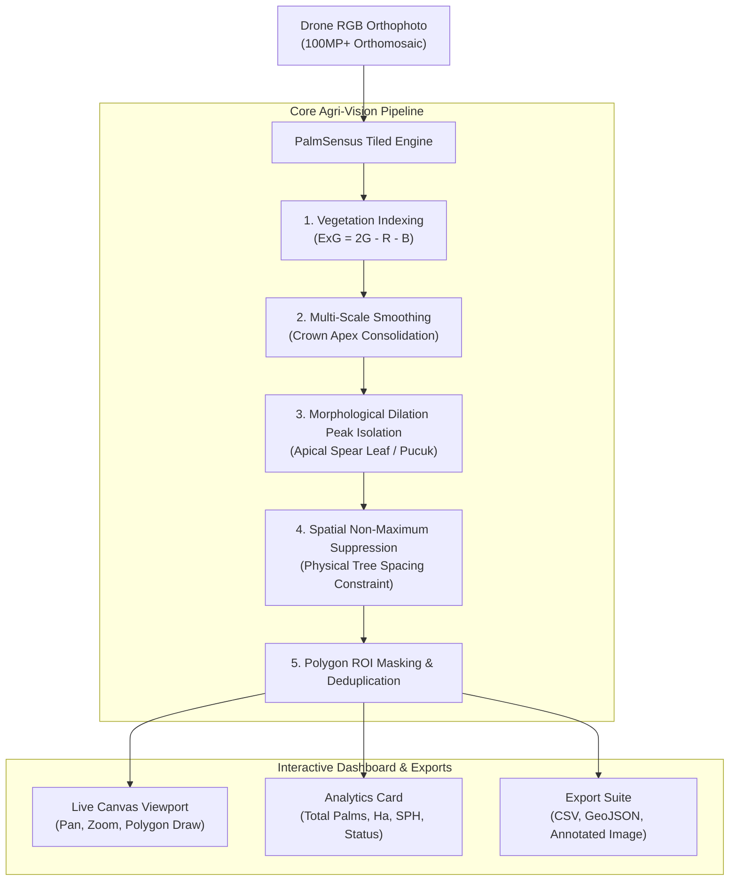

# 🌴 PalmSensus AI — Enterprise Drone Oil Palm Counting & Estate Analytics

> **High-Precision Computer Vision & Interactive Web Sensus Platform for Ultra-High-Resolution (100MP+) Drone Orthomosaics.**

[](https://python.org)
[](https://opencv.org)
[](https://palletsprojects.com/p/flask/)
[]()

---

## 📌 Executive Overview

Counting oil palms (*Elaeis guineensis*) across thousands of hectares manually is slow, error-prone, and labor-intensive. Standard AI detectors often crash or run out of memory when fed raw 100+ megapixel drone orthophotos.

**PalmSensus AI** solves this with an enterprise-grade, memory-efficient **Tiled Computer Vision Engine** paired with a responsive **Interactive Web Dashboard**:

* **Handles Ultra-Large Orthomosaics**: Built to process 100MP+ stitched aerial images (e.g. 15,000 × 9,200 px) smoothly without memory leaks.
* **Interactive Area (ROI) Selection**: Draw custom **Polygons** or **Bounding Boxes** around specific plantation blocks (*Blok TM, Blok TBM, Afdeling*).
* **Real-Time Sliders**: Instantly calibrate crown diameter, tree spacing, and vegetation sensitivity for your drone's flight altitude.
* **Point-and-Click Marker Editing**: Operators can click anywhere to add a missed palm or click an existing marker to delete a false positive.
* **Estate Agronomy Metrics**: Automatically calculates **Stand Per Hectare (SPH / Kerapatan Pokok)**, Hectarage, and compares against Indonesian palm oil industry standards (136–143 SPH).
* **Multi-Format Export**: Download high-resolution annotated maps, CSV coordinates for field GPS teams, and GeoJSON for QGIS/ArcGIS.

---

## 🏛️ System Architecture



---

## 🚀 Quickstart Guide

### 1. Prerequisites & Installation

Clone the repository and install the lightweight dependencies:

```bash
git clone https://github.com/your-username/palm-sensus-ai.git
cd palm-sensus-ai

pip install -r requirements.txt
```

### 2. Launch the Web Dashboard

```bash
python app.py
```

Open your web browser and navigate to:
```
http://127.0.0.1:5000
```

### 3. Run Automated CLI Batch Sensus

For automated workflows or scripting across multiple flights:

```bash
# Count mature plantation block
python cli.py --image "path/to/orthophoto.jpg" --preset mature --gsd 4.0 --output results/

# Count young plantation with custom bounding box
python cli.py --image "path/to/orthophoto.jpg" --preset young --bbox 500 10000 3500 14500 --output results/
```

---

## 🌿 Agronomic Calibration Guide

| Parameter | Mature Palm (TM) | Young Palm (TBM) | Purpose & Agronomic Context |
| :--- | :--- | :--- | :--- |
| **Crown Blur Radius** | `29 – 35 px` | `17 – 23 px` | Consolidates frond rosette geometry into a distinct apical spear peak (*pucuk*). |
| **Min Tree Spacing** | `65 – 80 px` | `42 – 52 px` | Prevents long interlocking fronds on the same palm from being double counted. |
| **Vegetation Sensitivity (ExG)** | `72 – 78` | `68 – 74` | Eliminates bare peat soil, water trenches (*parit*), collection roads, and shadows. |
| **Industry Target SPH** | `136 – 143 SPH` | `143 – 160 SPH` | Standard triangular equilateral grid ($9.0\text{m} \times 7.8\text{m}$ or $9.2\text{m} \times 8.0\text{m}$). |

---

## 📂 Project Structure

```
palm-sensus-ai/
├── engine/                     # Core computer vision engine
│   ├── __init__.py
│   ├── detector.py             # ExG, peak dilation, and spatial NMS
│   ├── tiler.py                # 100MP+ tiled chunk processing
│   └── roi_utils.py            # Shoelace polygon area, SPH, and masking
├── templates/
│   └── index.html              # Modern responsive dark-mode dashboard
├── static/
│   ├── app.js                  # Canvas pan/zoom, polygon draw, marker editor
│   └── style.css               # Styling & layout definitions
├── tests/
│   └── test_detector.py        # Automated unit & regression tests
├── cli.py                      # Terminal CLI batch processing tool
├── run_full_sensus.py          # Dedicated multi-block estate audit script
├── requirements.txt            # Python package dependencies
├── .gitignore                  # Git ignore rules
└── README.md                   # Enterprise documentation
```

---

## 📊 Export Formats

1. **CSV Coordinates (`.csv`)**:
   `id, block_name, x_full, y_full, x_overview, y_overview, confidence, crown_radius_px`
   Ready for import into handheld GPS, Microsoft Excel, or Google Earth.
2. **GeoJSON (`.geojson`)**:
   Standard OGC FeatureCollection with Point features containing tree IDs and confidence metadata for GIS tools (**QGIS**, **ArcGIS**).
3. **High-Resolution Annotated Map (`.jpg` / `.png`)**:
   Full-resolution crop of the active block with numbered markers and crown circles.

---

## 🧪 Testing

Run the automated test suite:

```bash
python -m unittest discover -s tests
```

---

## 📄 License
Developed for commercial agricultural drone surveying and estate management.
